<div align="center">

# SIWarga
### Neighborhood Association (RT) Administration System

🇮🇩 [Bahasa Indonesia](README.md)&nbsp;&nbsp;|&nbsp;&nbsp;🇬🇧 English

</div>

A web application for managing RT (Indonesian neighborhood association) administration: residents, houses, monthly dues, payments, expenses, and financial reports. Built with an **API-first (decoupled)** architecture — a Laravel API backend and a React SPA frontend, fully independent of each other.

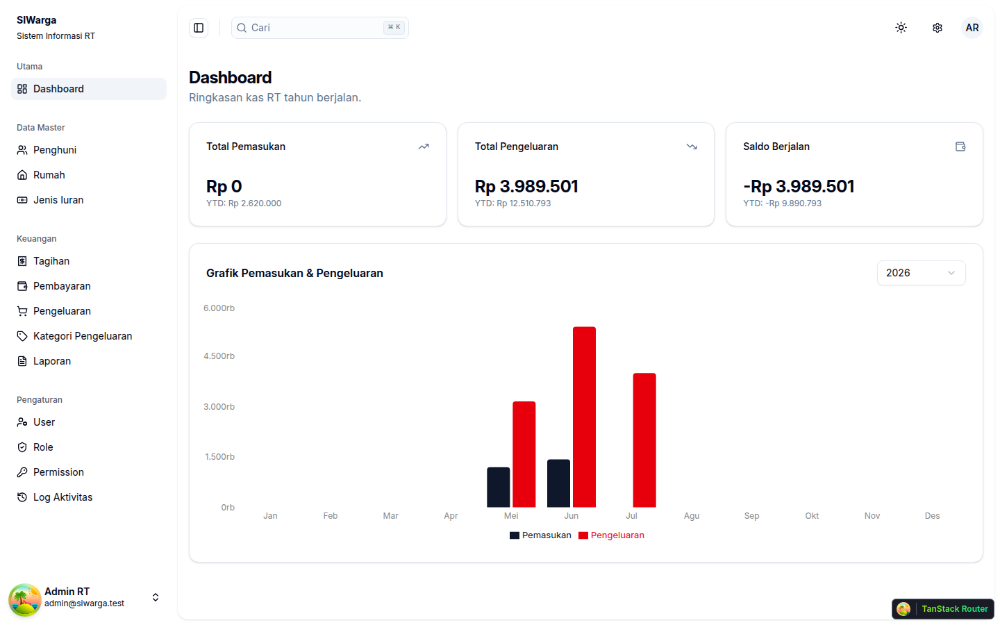

## Table of Contents

- [Key Features](#key-features)
- [Tech Stack](#tech-stack)
- [Repository Structure](#repository-structure)
- [Installation](#installation)
  - [Option 1 — Native Without Docker (Local Development)](#option-1--native-without-docker-local-development)
  - [Option 2 — Docker (Optional)](#option-2--docker-optional)
  - [Option 3 — Native / Manual (for VPS Production)](#option-3--native--manual-for-vps-production)
- [Demo Accounts](#demo-accounts)
- [API Endpoints](#api-endpoints)
- [Testing](#testing)
- [Screenshots](#screenshots)
- [License](#license)

## Key Features

| Module | Description |
|---|---|
| 👤 **Resident Management** | CRUD residents with ID photo, contract/permanent status, marital status |
| 🏠 **House Management** | CRUD houses, resident history (timeline), assign/transfer residents |
| 💵 **Dues & Bills** | Due-type master data, monthly bill generation (idempotent), annual due support |
| 💳 **Payments** | Record payments against bills, bill status auto-updates to paid |
| 🧾 **Expenses** | Record RT operational expenses with free-form categories |
| 📊 **Dashboard & Reports** | Yearly income vs. expense chart, monthly detail report |
| 🔐 **Granular RBAC** | 3 roles (Admin, Treasurer, Resident), per-action permissions, not hardcoded |
| 🔑 **Authentication** | Login/logout via Laravel Sanctum (token-based, 24h expiry, refresh) |
| 📝 **Activity Log** | Audit trail for important actions across the application |

## Tech Stack

| Layer | Technology |
|---|---|
| Backend | Laravel 13.x, PHP 8.3 |
| Auth | Laravel Sanctum (token-based) |
| Database | MySQL 8.x |
| Backend testing | PHPUnit (Unit + Feature) |
| Frontend | React 19 + TypeScript + Vite |
| UI Kit | shadcn/ui (shadcn-admin template) |
| State/Data | Zustand (auth) + TanStack Query (server state) |
| Routing | TanStack Router |
| Charts | Recharts |
| Forms | React Hook Form + Zod |
| Mock API (dev) | MSW (Mock Service Worker) |
| Frontend testing | Vitest + React Testing Library |
| E2E | Playwright |

## Repository Structure

```
siwarga/
├── docker-compose.yml           # Development stack (Docker)
├── docker-compose.prd.yml       # Production stack (Docker)
├── .env.example                 # Env for both docker-compose files above
├── src/
│   ├── backend/                 # Laravel API
│   │   ├── app/
│   │   │   ├── Http/Controllers/Api/   # API Controllers
│   │   │   ├── Http/Resources/         # API Resources
│   │   │   ├── Models/                 # Eloquent Models
│   │   │   ├── Policies/               # Authorization Policies
│   │   │   └── Services/               # Business logic (bill generation, reports, etc.)
│   │   ├── database/
│   │   │   ├── migrations/
│   │   │   └── seeders/
│   │   ├── routes/api.php
│   │   ├── tests/{Feature,Unit}/
│   │   ├── Dockerfile                  # Development image
│   │   └── Dockerfile.prd              # Production image
│   └── frontend/                 # React SPA (shadcn-admin)
│       ├── e2e/                        # Playwright specs
│       ├── src/
│       │   ├── features/               # Per-domain modules (residents, houses, bills, etc.)
│       │   ├── hooks/                  # TanStack Query hooks
│       │   ├── services/               # API client layer
│       │   ├── mocks/                  # MSW handlers
│       │   ├── routes/                 # TanStack Router
│       │   └── stores/                 # Zustand
│       ├── Dockerfile                  # Development image
│       └── Dockerfile.prd              # Production image
└── docs/
    ├── PRD.md
    └── ERD.dbml
```

## Installation

SIWarga is designed to run **natively, without Docker as its base** — Option 1 (local development) and Option 3 (VPS production) both run PHP/Node/MySQL directly on the machine. Docker (Option 2) is provided purely as an optional convenience for those already comfortable with Docker who'd rather skip installing dependencies manually; both paths produce an identical application.

### Option 1 — Native Without Docker (Local Development)

This guide runs SIWarga directly on your own laptop/computer for development purposes, without Docker and without Nginx/systemd.

**Prerequisites** (install manually for your OS):

| Requirement | Version | Check with |
|---|---|---|
| PHP | 8.3 (+ extensions `mbstring`, `xml`, `bcmath`, `curl`, `zip`, `gd`, `tokenizer`, `pdo_mysql`) | `php -v` |
| Composer | 2.x | `composer --version` |
| Node.js | 20+ | `node -v` |
| MySQL | 8.x (server running on `localhost:3306`) | `mysql --version` |

> Missing one of the above? See steps 2–5 in [Option 3](#option-3--native--manual-for-vps-production) for how to install PHP/Composer/Node/MySQL on Ubuntu — skip the Nginx/PHP-FPM/systemd parts.

#### 1. Clone the repository & prepare the database

```bash
git clone https://github.com/rizalord/siwarga.git
cd siwarga

mysql -u root -p -e "CREATE DATABASE siwarga CHARACTER SET utf8mb4 COLLATE utf8mb4_unicode_ci;"
```

#### 2. Set up & run the backend

```bash
cd src/backend
composer install

cp .env.example .env
php artisan key:generate
```

Edit `.env` and adjust the database credentials (`DB_DATABASE`, `DB_USERNAME`, `DB_PASSWORD`) to match what you created in step 1.

```bash
php artisan migrate --seed
php artisan storage:link   # required, so resident ID photos are accessible

php artisan serve
```

The backend API runs at `http://localhost:8000`.

#### 3. Set up & run the frontend

Open a new terminal:

```bash
cd src/frontend
npm install

cp .env.example .env
```

Make sure `.env` contains:

```ini
VITE_API_URL=http://localhost:8000
VITE_USE_MOCK=false
```

```bash
npm run dev
```

The frontend runs at `http://localhost:5173` with hot reload. Open it in your browser and log in with one of the [demo accounts](#demo-accounts).

> Want to try the frontend UI without a backend at all? Set `VITE_USE_MOCK=true` in `.env` — data is simulated via MSW (Mock Service Worker), no backend/MySQL needed.

---

### Option 2 — Docker (Optional)

This option is purely a convenience for those already comfortable with Docker — it is not the official or required way to run SIWarga. If in doubt, use [Option 1](#option-1--native-without-docker-local-development) above.

**Prerequisites:** [Docker Engine](https://docs.docker.com/engine/install/) & Docker Compose v2.

#### Development

Source code is bind-mounted into the containers, so code changes are reflected live (Vite HMR on the frontend, PHP re-interprets every request on the backend) without rebuilding the image.

```bash
git clone https://github.com/rizalord/siwarga.git
cd siwarga

cp .env.example .env
# generate an APP_KEY first (optional for dev, but recommended):
docker compose run --rm backend php artisan key:generate --show
# paste the result into APP_KEY= in .env

docker compose up --build
```

| Service | URL |
|---|---|
| Frontend | http://localhost:5173 |
| Backend API | http://localhost:8000 |
| MySQL | localhost:3306 |

Migrations run automatically when the backend container starts. Seed demo data once, manually:

```bash
docker compose exec backend php artisan db:seed
```

> **Storage / ID photos:** the `public/storage` symlink is created automatically by the backend container on start with a **relative** target (`../storage/app/public`), so it stays valid when switching between Option 1 (native) and Docker. If you previously ran Option 1 first, remove the old symlink once and let the container recreate it — see [Troubleshooting](#troubleshooting).

#### Production

The production images build the backend into a single optimized php-fpm + nginx image, and the frontend into a static bundle served by nginx — no bind mounts, everything is baked into the image at build time.

```bash
cp .env.example .env
# APP_KEY MUST be set for production:
docker compose run --rm backend php artisan key:generate --show
# paste the result into APP_KEY= in .env, then adjust DB credentials & domain

docker compose -f docker-compose.prd.yml up --build -d
```

| Service | URL |
|---|---|
| Frontend | http://localhost:8080 |
| Backend API | http://localhost:8000 |

> `VITE_API_URL` and `VITE_USE_MOCK` are baked into the frontend bundle at **image build time** (build arg), not at runtime. If the value changes (e.g. a different API domain), rebuild: `docker compose -f docker-compose.prd.yml build frontend`.

Common operational commands:

```bash
# Tail logs
docker compose -f docker-compose.prd.yml logs -f backend

# Run an artisan command
docker compose -f docker-compose.prd.yml exec backend php artisan migrate --force

# Seed initial data (once)
docker compose -f docker-compose.prd.yml exec backend php artisan db:seed --force
```

---

### Option 3 — Native / Manual (for VPS Production)

This guide deploys directly on a server (VPS) without Docker: native PHP-FPM + Nginx + MySQL. Every step is sequential, from a clean server to a reachable application. Examples below use Ubuntu 22.04/24.04; adjust package names for other distros.

> For local development on your own machine, use [Option 1](#option-1--native-without-docker-local-development) instead — it's much shorter.

#### 1. Update the system & install base dependencies

```bash
sudo apt update && sudo apt upgrade -y
sudo apt install -y curl git unzip software-properties-common
```

#### 2. Install PHP 8.3 + required extensions

```bash
sudo add-apt-repository ppa:ondrej/php -y
sudo apt update
sudo apt install -y php8.3 php8.3-fpm php8.3-cli php8.3-mysql php8.3-mbstring \
    php8.3-xml php8.3-bcmath php8.3-curl php8.3-zip php8.3-gd php8.3-tokenizer

php -v   # confirm PHP 8.3.x
```

#### 3. Install Composer

```bash
curl -sS https://getcomposer.org/installer | php
sudo mv composer.phar /usr/local/bin/composer
composer --version
```

#### 4. Install Node.js 20+ & npm

```bash
curl -fsSL https://deb.nodesource.com/setup_20.x | sudo -E bash -
sudo apt install -y nodejs
node -v && npm -v
```

#### 5. Install & set up MySQL 8

```bash
sudo apt install -y mysql-server
sudo mysql_secure_installation

sudo mysql -u root -p
```

Inside the MySQL prompt:

```sql
CREATE DATABASE siwarga CHARACTER SET utf8mb4 COLLATE utf8mb4_unicode_ci;
CREATE USER 'siwarga'@'localhost' IDENTIFIED BY 'REPLACE_WITH_A_STRONG_PASSWORD';
GRANT ALL PRIVILEGES ON siwarga.* TO 'siwarga'@'localhost';
FLUSH PRIVILEGES;
EXIT;
```

#### 6. Install Nginx

```bash
sudo apt install -y nginx
```

#### 7. Clone the repository & set up the backend

```bash
sudo mkdir -p /var/www/siwarga
sudo chown $USER:$USER /var/www/siwarga
git clone https://github.com/rizalord/siwarga.git /var/www/siwarga
cd /var/www/siwarga/src/backend

composer install --optimize-autoloader
```

> `fakerphp/faker` is a `require-dev` package, but the demo seeders (e.g. `ResidentSeeder`) use the `fake()` helper, which needs it. Don't use `--no-dev` here if you plan to run `migrate --seed`.

```bash
cp .env.example .env
php artisan key:generate
```

Edit `.env`, adjusting at least the following:

```ini
APP_NAME=SIWarga
APP_ENV=production
APP_DEBUG=false
APP_URL=https://api.your-domain.com

DB_CONNECTION=mysql
DB_HOST=127.0.0.1
DB_PORT=3306
DB_DATABASE=siwarga
DB_USERNAME=siwarga
DB_PASSWORD=REPLACE_WITH_A_STRONG_PASSWORD
```

Continue setup:

```bash
php artisan migrate --seed
php artisan storage:link

# Cache config/routes for production (skip for development)
php artisan config:cache
php artisan route:cache

# Permissions so Nginx/PHP-FPM can write to storage & cache
sudo chown -R www-data:www-data storage bootstrap/cache
sudo chmod -R 775 storage bootstrap/cache
```

#### 8. Configure the PHP-FPM pool (optional, adjust to server capacity)

The default `www` pool is usually enough for RT-scale usage (a few dozen houses). If you need user isolation, create a new pool at `/etc/php/8.3/fpm/pool.d/siwarga.conf` following the `www.conf` example, then:

```bash
sudo systemctl restart php8.3-fpm
```

#### 9. Configure Nginx for the backend (API)

Create `/etc/nginx/sites-available/siwarga-api`:

```nginx
server {
    listen 80;
    server_name api.your-domain.com;
    root /var/www/siwarga/src/backend/public;
    index index.php;

    client_max_body_size 20m;

    location / {
        try_files $uri $uri/ /index.php?$query_string;
    }

    location ~ \.php$ {
        fastcgi_pass unix:/run/php/php8.3-fpm.sock;
        fastcgi_index index.php;
        fastcgi_param SCRIPT_FILENAME $document_root$fastcgi_script_name;
        include fastcgi_params;
    }

    location ~ /\.(?!well-known).* {
        deny all;
    }
}
```

Enable it:

```bash
sudo ln -s /etc/nginx/sites-available/siwarga-api /etc/nginx/sites-enabled/
sudo nginx -t
sudo systemctl reload nginx
```

#### 10. Build & deploy the frontend

```bash
cd /var/www/siwarga/src/frontend
npm install

cp .env.example .env
```

Edit `.env`:

```ini
VITE_API_URL=https://api.your-domain.com
VITE_USE_MOCK=false
```

Build for production:

```bash
npm run build   # static output in ./dist
```

Create `/etc/nginx/sites-available/siwarga-app`:

```nginx
server {
    listen 80;
    server_name app.your-domain.com;
    root /var/www/siwarga/src/frontend/dist;
    index index.html;

    gzip on;
    gzip_types text/plain text/css application/javascript application/json image/svg+xml;

    location / {
        try_files $uri $uri/ /index.html;
    }

    location ~* \.(?:css|js|svg|png|jpg|jpeg|gif|ico|woff2?)$ {
        expires 7d;
        add_header Cache-Control "public, immutable";
    }
}
```

Enable it:

```bash
sudo ln -s /etc/nginx/sites-available/siwarga-app /etc/nginx/sites-enabled/
sudo nginx -t
sudo systemctl reload nginx
```

#### 11. HTTPS with Let's Encrypt (strongly recommended for production)

```bash
sudo apt install -y certbot python3-certbot-nginx
sudo certbot --nginx -d api.your-domain.com -d app.your-domain.com
```

Certbot automatically updates the Nginx configs above to redirect to HTTPS and sets up auto-renewal.

#### 12. Done — verify

```bash
curl -I https://api.your-domain.com/api/auth/login
```

Open `https://app.your-domain.com` in a browser and log in with a [demo account](#demo-accounts) (change the password right after first login for production use).

## Troubleshooting

### `403 Forbidden` (or `404`) when accessing `/storage/*` — e.g. resident ID photos don't load

The most common cause: the `public/storage` symlink points to an absolute host path (created by `php artisan storage:link` while running Option 1 native), but that path doesn't exist inside the Docker container — so the symlink is broken.

Check and fix (create it with a **relative** path so it works both natively and in Docker):

```bash
cd src/backend
ls -la public/storage                  # inspect the current symlink target
rm -f public/storage
ln -s ../storage/app/public public/storage
```

Then refresh the page and confirm storage is reachable:

```bash
curl -I http://localhost:8000/storage/ktp-photos/<file-name>.jpg   # expect 200
```

On the Docker workflow this symlink is also recreated automatically each time the backend container starts, so you only need to fix it once.

## Demo Accounts

The seeder (`php artisan migrate --seed` or `db:seed`) automatically creates 3 accounts (one per role) plus realistic demo data: 20 houses (15 permanently occupied, 3 occupied on contract, 2 vacant), 18 residents, bills for the last 3 months (some already paid), and operational expenses.

| Role | Email | Password | Access |
|---|---|---|---|
| Admin | `admin@siwarga.test` | `password` | Full access |
| Treasurer (Bendahara) | `bendahara@siwarga.test` | `password` | Manage payments, expenses, reports |
| Resident (Warga) | `warga@siwarga.test` | `password` | View only their own bills & payments |

## API Endpoints

| Method | Endpoint | Description |
|---|---|---|
| POST | `/api/auth/login` | Login → token (24h) + user + permissions |
| POST | `/api/auth/logout` | Revoke the active token |
| POST | `/api/auth/refresh` | Refresh the token |
| GET | `/api/auth/me` | Current user + permissions |
| `GET/POST/PUT/DELETE` | `/api/residents` | Resident CRUD |
| `GET/POST/PUT/DELETE` | `/api/houses` | House CRUD |
| GET | `/api/houses/{id}/history` | House resident history |
| POST | `/api/houses/{id}/assign-resident` | Assign a resident to a house |
| POST | `/api/houses/{id}/vacate-resident` | Vacate a house (close residency history) |
| `GET/POST/PUT/DELETE` | `/api/due-types` | Due-type CRUD |
| `GET/POST/DELETE` | `/api/bills` | List, generate, delete bills |
| `GET/POST/PUT/DELETE` | `/api/payments` | List, record, delete payments |
| `GET/POST/PUT/DELETE` | `/api/expenses` | Expense CRUD |
| GET | `/api/reports/summary/{year}` | Yearly chart summary + balance |
| GET | `/api/reports/monthly/{year}/{month}` | Monthly detail report |
| `GET/POST/PUT/DELETE` | `/api/users` | User CRUD (Admin only) |
| `GET/POST/PUT/DELETE` | `/api/roles`, `/api/permissions` | Manage roles & permissions (Admin only) |
| GET | `/api/activity-logs` | Audit trail |

## Testing

```bash
# Backend (PHPUnit)
cd src/backend
php artisan test

# Frontend (Vitest)
cd src/frontend
npm run test              # single run
npm run test:watch        # watch mode
npm run test:coverage     # with coverage report

# E2E (Playwright) — backend & frontend must be running
npx playwright install    # once
npx playwright test
npx playwright test e2e/siwarga/auth.spec.ts   # single spec
```

## Screenshots

| | |
|---|---|
| 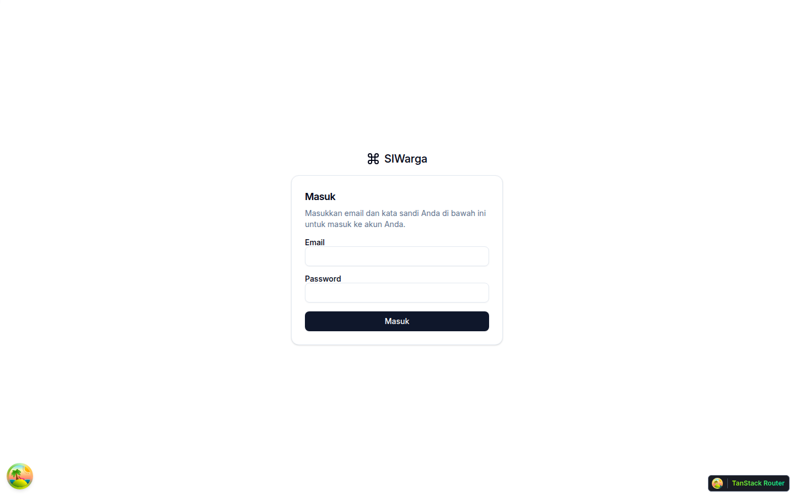 Login |  Dashboard |
| 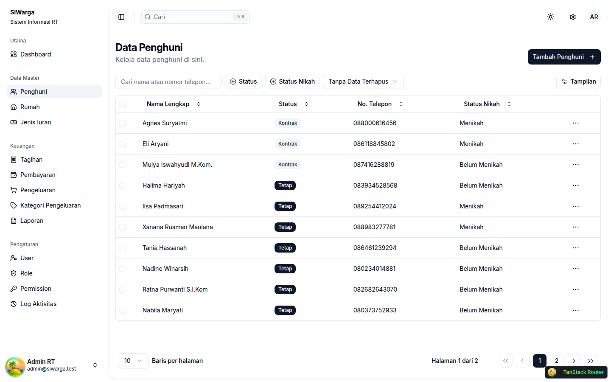 Resident List | 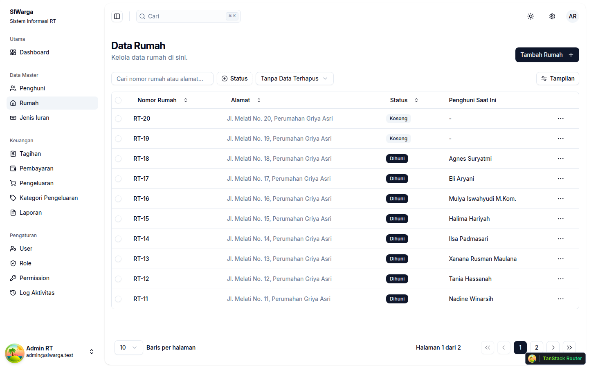 House List |
| 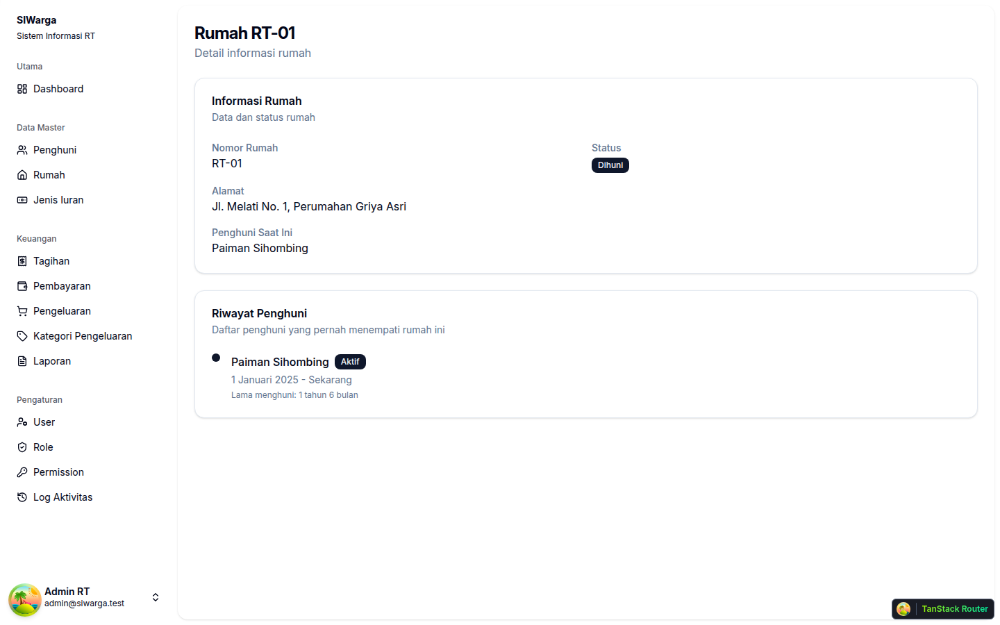 House Detail + History | 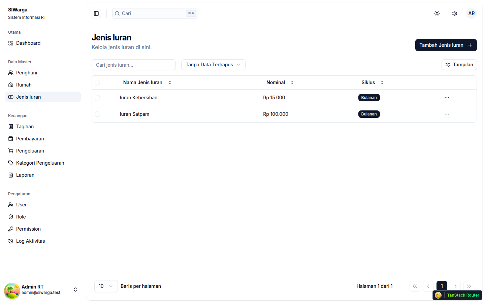 Due Types |
| 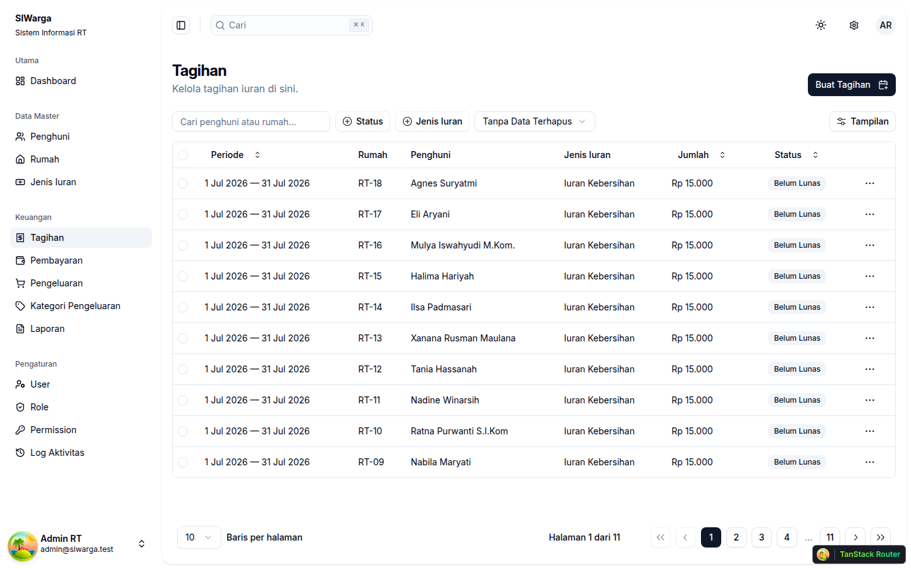 Bills | 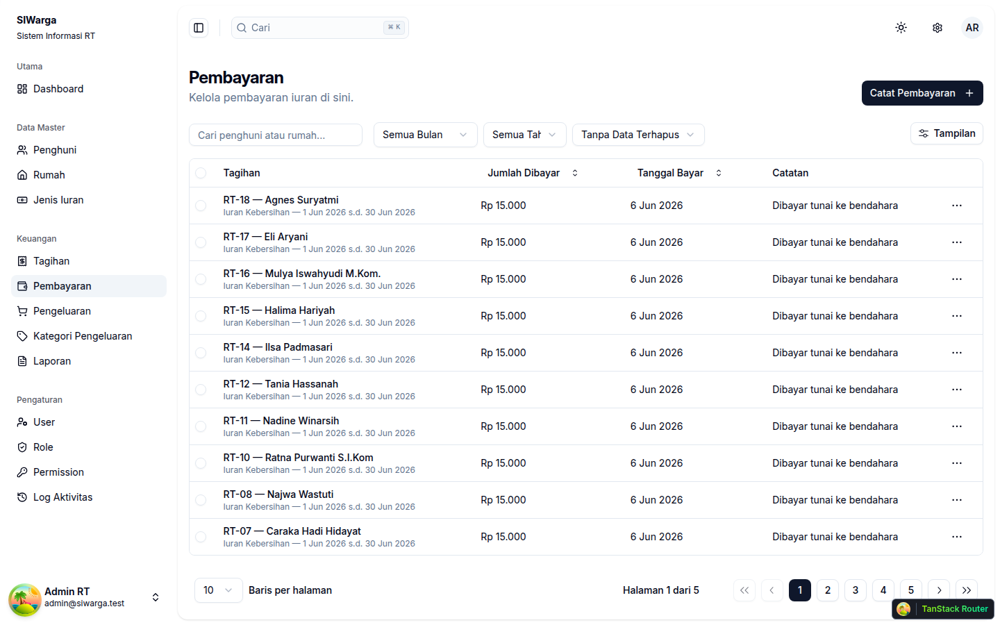 Payments |
| 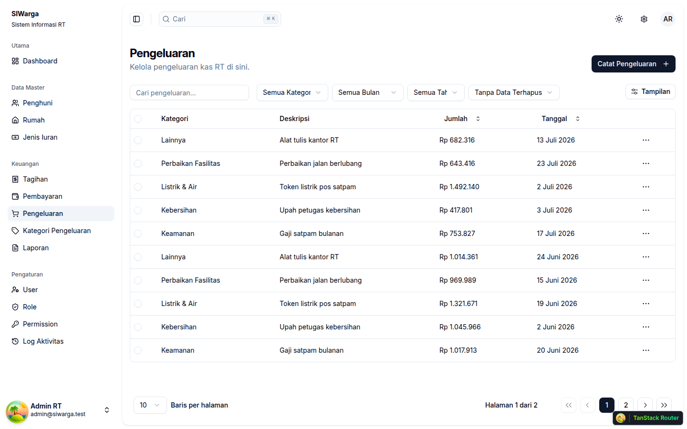 Expenses | 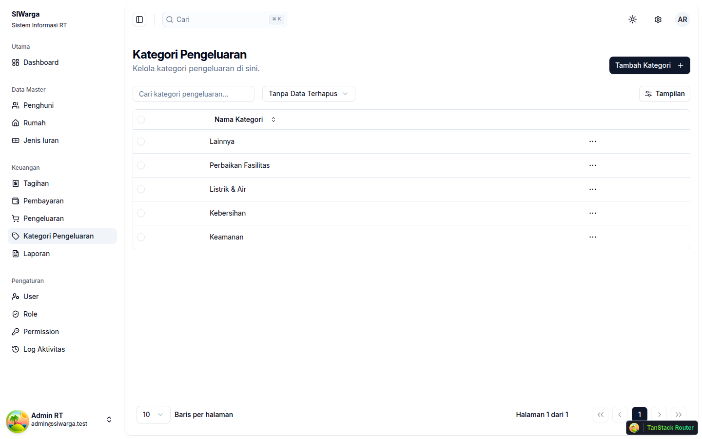 Expense Categories |
| 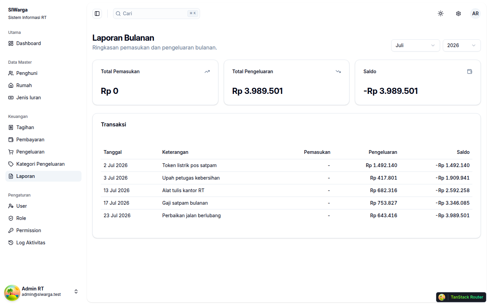 Monthly Report | 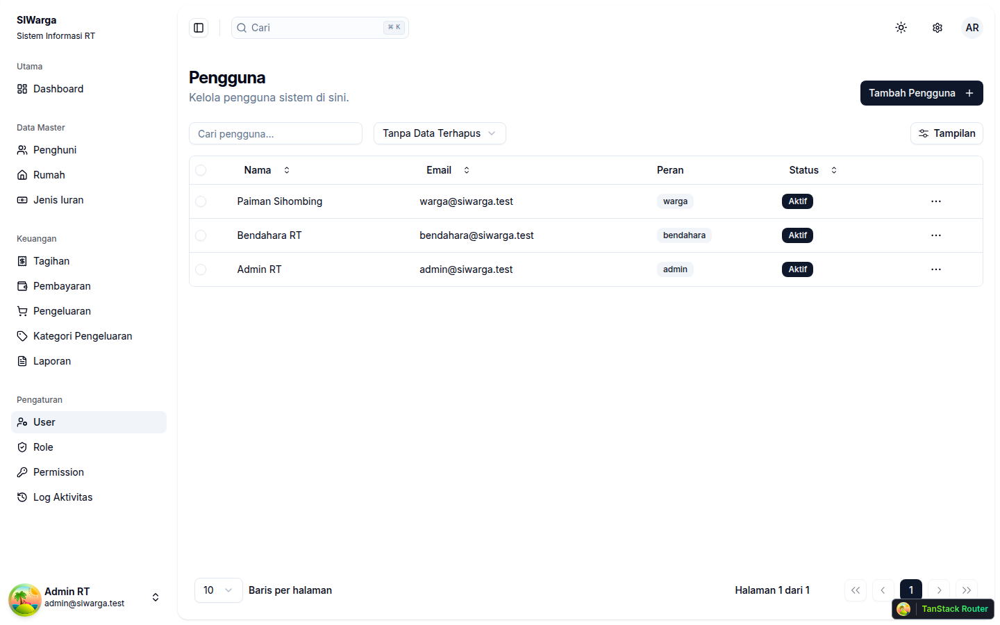 User Management |
| 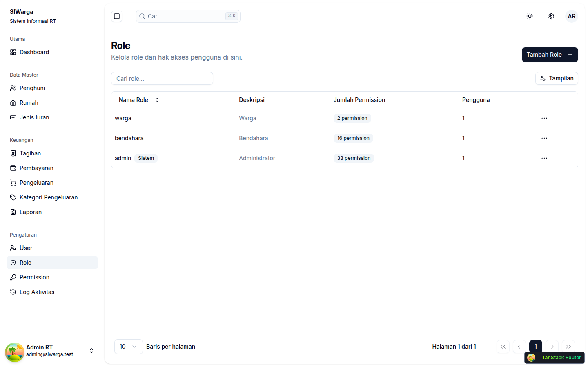 Role Management | 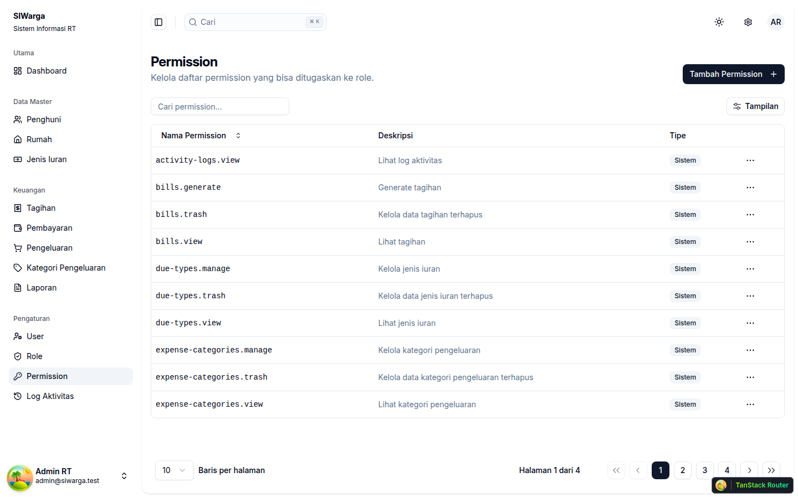 Permission Management |
| 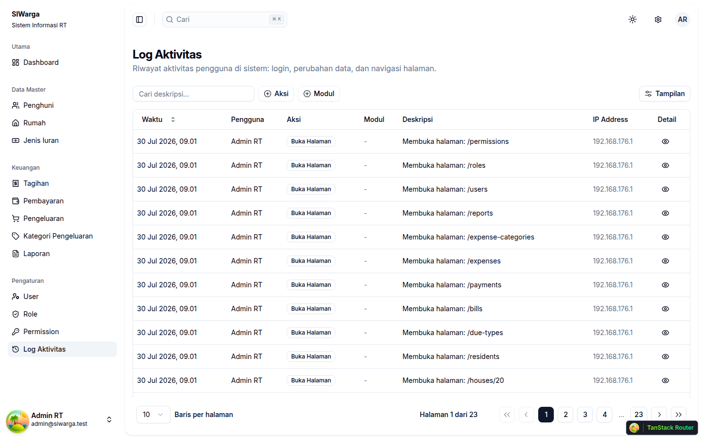 Activity Log | |

## License

This project was built for the **Skill Fit Test — PT Beon Intermedia (JagoanHosting)**, and continues as a production application for the author's own housing complex.

---

<div align="center">

**Built with ❤️ by Ahmad Rizal Khamdani**

</div>
